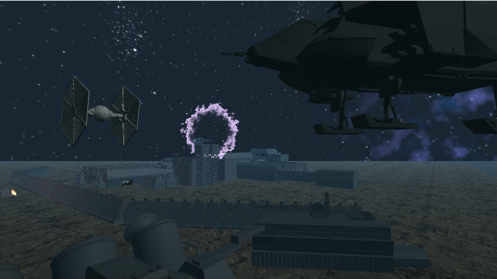

# AlienGame
## My First 3D application written in OpenGL (C++)
 - semestral project for Computer Graphics Programming course (https://cent.felk.cvut.cz/courses/PGR/)
 - C++, OpenGL, GLSL
 - Materials, Textures, Phong model, Parametric curves, Sprites, Billboards, Skybox, Fog...

   

